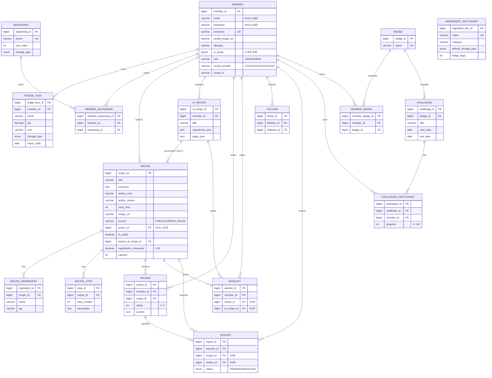

# 🥬 냉큼(Naeng-Keum) — ERD 설계서 (현행)

> [!NOTE]
> **이 문서는 실제 구현(Flyway `V1`~`V19`) 기준으로 동기화된 현행본입니다.** — 총 **17개 테이블**.
> 2026-06-23 갱신: `recipe.ingredients_consumed`(V19, 공개 시 재고 1회 차감 플래그) 반영.
> 노션 미러: [ERD 설계서 (최신 — 17개 테이블)](https://app.notion.com/p/3888d73381d181e5b8afd6d3068a6e4e)

> **DB**: MySQL 8 (InnoDB, `utf8mb4`) · **ORM**: MyBatis (XML Mapper) · **마이그레이션**: Flyway `V1`~`V19`
> **명명규칙**: snake_case, PK는 `{table}_id` BIGINT AUTO_INCREMENT, 시간 컬럼 `created_at`/`updated_at` DEFAULT CURRENT_TIMESTAMP

---

## 1. 테이블 목록 (17개)

| # | 도메인 | 테이블 | 비고 |
| --- | --- | --- | --- |
| 1 | 회원 | `member` | 소셜 로그인·권한·프로필 컬럼 포함 |
| 2 | 냉장고 | `fridge_item` | 재료 CRUD, 보관위치, 유통기한 |
| 3 | 냉장고 | `seasoning` | 조미료 마스터 (큐레이션) · `V15` |
| 4 | 냉장고 | `member_seasoning` | 회원 보유 조미료 (행 존재=보유) · `V15` |
| 5 | 사전 | `ingredient_dictionary` | 식재료 보관기한 마스터 · `V5` |
| 6 | 레시피 | `recipe` | 공공 시드 + 사용자/AI 담기 레시피 |
| 7 | 레시피 | `recipe_ingredient` | 레시피별 재료 |
| 8 | 레시피 | `recipe_step` | 조리 단계 |
| 9 | 레시피 | `ai_recipe` | AI 생성 레시피 (JSON 보관) |
| 10 | 커뮤니티 | `review` | 레시피 리뷰 (평점 1~5) |
| 11 | 커뮤니티 | `wishlist` | 찜 (일반/AI XOR) |
| 12 | 커뮤니티 | `follow` | 팔로우 관계 |
| 13 | 커뮤니티 | `report` | 콘텐츠 신고 (레시피/리뷰 XOR) · `V10` |
| 14 | 게이미피케이션 | `badge` | 배지 마스터 |
| 15 | 게이미피케이션 | `challenge` | 챌린지 |
| 16 | 게이미피케이션 | `challenge_participant` | 챌린지 참여·진행률 |
| 17 | 게이미피케이션 | `member_badge` | 회원 획득 배지 |

---

## 2. ERD 다이어그램

---

## 3. 테이블 상세

### 👤 member — 회원

| 컬럼 | 타입 | 제약 | 기본값 | 설명 | 마이그 |
| --- | --- | --- | --- | --- | --- |
| member_id | BIGINT | PK, AUTO_INCREMENT | - | 회원 고유 ID | V1 |
| email | VARCHAR(100) | UNIQUE, NULL | NULL | 로그인 이메일 (소셜은 미제공 가능) | V1 / V13 |
| password | VARCHAR(255) | NULL | NULL | BCrypt 해시 (소셜 회원은 NULL) | V1 / V13 |
| nickname | VARCHAR(20) | UNIQUE, NOT NULL | - | 화면 표시명 | V1 |
| profile_image_url | VARCHAR(500) | NULL | NULL | 프로필 사진 URL (NULL=글자 아바타) | V11 |
| allergies | VARCHAR(255) | NULL | NULL | 알레르기 식재료 (콤마 구분) | V1 |
| marketing_agree | TINYINT(1) | NOT NULL | 0 | 마케팅 수신 동의 | V1 |
| is_active | TINYINT(1) | NOT NULL | 1 | 소프트 삭제 플래그 (0=탈퇴) | V1 |
| role | VARCHAR(10) | NOT NULL | 'USER' | 권한 (USER/ADMIN) | V8 |
| social_provider | VARCHAR(20) | NOT NULL | 'LOCAL' | 가입 경로 (LOCAL/GOOGLE/KAKAO) | V13 |
| social_id | VARCHAR(100) | NULL | NULL | 소셜 제공자 고유 ID | V13 |
| created_at / updated_at | DATETIME | NOT NULL | CURRENT_TIMESTAMP | 생성/수정 | V1 |

`UNIQUE` uq_member_email(email) · uq_member_nickname(nickname) · uq_member_social(social_provider, social_id) · `KEY` idx_member_role(role)

### 🧊 fridge_item — 냉장고 재료

| 컬럼 | 타입 | 제약 | 기본값 | 설명 |
| --- | --- | --- | --- | --- |
| fridge_item_id | BIGINT | PK | - | - |
| member_id | BIGINT | FK(member) CASCADE, NOT NULL | - | 소유 회원 |
| name | VARCHAR(50) | NOT NULL | - | 재료명 |
| qty | DECIMAL(10,2) | NOT NULL, CHECK ≥ 0 | - | 수량 |
| unit | VARCHAR(10) | NOT NULL | - | 단위 (개/g/ml/L 등) |
| storage_type | ENUM | NOT NULL | 'FRIDGE' | FRIDGE/FREEZER/ROOM_TEMP |
| expiry_date | DATE | NOT NULL | - | 유통기한일 |
| memo | VARCHAR(100) | NULL | NULL | 메모 |

`CHECK` chk_fridge_qty_positive(qty ≥ 0) — 음수 수량 차단(LLM 프롬프트 보호) · `KEY` idx_fridge_expiry(member_id, expiry_date)

### 🧂 seasoning / member_seasoning — 조미료 (V15)

**seasoning** (마스터): `seasoning_id` PK · `name` VARCHAR(30) UNIQUE · `sort_order` INT · `storage_type` ENUM(FRIDGE/FREEZER/ROOM_TEMP) · `storage_tip` VARCHAR(200)
**member_seasoning** (보유): `member_seasoning_id` PK · `member_id` FK CASCADE · `seasoning_id` FK CASCADE · **UNIQUE(member_id, seasoning_id)** — 행 존재=보유, 수량·기한 없음

### 📖 ingredient_dictionary — 식재료 사전 (V5)

| 컬럼 | 타입 | 제약 | 설명 |
| --- | --- | --- | --- |
| ingredient_dict_id | BIGINT | PK | - |
| name | VARCHAR(50) | UNIQUE | 식재료명 |
| category | VARCHAR(30) | NOT NULL | 채소/과일/육류/수산물/유제품/계란두부/곡류면/양념/가공 |
| default_storage_type | ENUM | NOT NULL | 권장 보관 위치 |
| fridge_days / freezer_days / room_temp_days | INT | CHECK(>0 또는 NULL) | 보관 가능 일수 |
| storage_tip | VARCHAR(200) | NULL | 보관 팁 |

`KEY` idx_ingredient_dict_category(category) · 150종+ 시드 (V5 + V16 확장)

### 🍳 recipe — 레시피

| 컬럼 | 타입 | 제약 | 기본값 | 설명 | 마이그 |
| --- | --- | --- | --- | --- | --- |
| recipe_id | BIGINT | PK | - | - | V1 |
| title | VARCHAR(100) | NOT NULL | - | 레시피명 | V1 |
| summary | TEXT | NULL | NULL | 간단 소개 (AI 생성/시드) | V1 |
| author_note | VARCHAR(500) | NULL | NULL | 작성자 한마디 (담을 때) | V17 |
| author_review | VARCHAR(1000) | NULL | NULL | 작성자 후기 (상세에서 작성/수정) | V18 |
| cook_time | INT | CHECK(>0 또는 NULL) | NULL | 조리 시간(분) | V1 |
| image_url | VARCHAR(500) | NULL | NULL | 대표 이미지 | V1 |
| source | VARCHAR(50) | - | 'PUBLIC' | 출처 (PUBLIC/USER/AI_SAVED) | V1 |
| author_id | BIGINT | FK(member) SET NULL | NULL | 작성자 (NULL=공공 시드) | V6 |
| is_public | BOOLEAN | NOT NULL | FALSE | 공개 여부 (공개 카탈로그=TRUE만) | V6 |
| source_ai_recipe_id | BIGINT | FK(ai_recipe) SET NULL | NULL | 담기 출처 AI 레시피 | V6 |
| **ingredients_consumed** | **BOOLEAN** | **NOT NULL** | **FALSE** | **공개 시 재고 차감 완료(재공개 중복 차감 방지)** | **V19** |
| calories / carbs / protein / fat / sodium | INT·DECIMAL | NULL | NULL | 영양정보 (식약처 COOKRCP01, 1인분) | V1 |
| view_count | INT | NOT NULL | 0 | 조회수 | V1 |

`CHECK` chk_recipe_cook_time · `UNIQUE` uq_recipe_author_srcai(author_id, source_ai_recipe_id) — 동일 AI 레시피 중복 담기 차단 · `KEY` idx_recipe_public(is_public) · idx_recipe_cook_time · idx_recipe_view_count(DESC) · `FULLTEXT` idx_recipe_title(ngram)

### 🥪 recipe_ingredient / recipe_step

**recipe_ingredient**: `ingredient_id` PK · `recipe_id` FK CASCADE · `name` VARCHAR(50) · `qty` VARCHAR(50)(예: "2개","100g","적당량") · `KEY` idx_ingredient_name(name)
**recipe_step**: `step_id` PK · `recipe_id` FK CASCADE · `step_number` INT CHECK(>0) · `description` TEXT · `image_url` · **UNIQUE(recipe_id, step_number)**

### 🤖 ai_recipe — AI 생성 레시피

| 컬럼 | 타입 | 제약 | 설명 |
| --- | --- | --- | --- |
| ai_recipe_id | BIGINT | PK | - |
| member_id | BIGINT | FK(member) CASCADE | 요청 회원 |
| title | VARCHAR(100) | NOT NULL | AI 생성 레시피명 |
| summary | TEXT | NULL | AI 생성 소개 |
| ingredients_json | JSON | NOT NULL, CHECK(JSON_TYPE=ARRAY) | 재료 JSON 배열 |
| steps_json | JSON | NOT NULL, CHECK(JSON_TYPE=ARRAY) | 조리 순서 JSON 배열 |
| cook_time | INT | NULL | 예상 조리 시간 |

`CHECK` chk_ai_ingredients_array · chk_ai_steps_array — LLM이 객체 반환 시 DB단 차단 · `KEY` idx_ai_recipe_member_created(member_id, created_at DESC)

### ⭐ review — 리뷰

`review_id` PK · `member_id` FK CASCADE · `recipe_id` FK CASCADE · `rating` INT CHECK(1~5) · `content` TEXT · **UNIQUE(member_id, recipe_id)** — 회원당 레시피 1리뷰(409 트리거) · `KEY` idx_review_recipe_created(recipe_id, created_at DESC)

### 💖 wishlist — 찜

`wishlist_id` PK · `member_id` FK CASCADE · `recipe_id` FK CASCADE(NULL 가능) · `ai_recipe_id` FK CASCADE(NULL 가능) · **UNIQUE(member_id, recipe_id)** · **UNIQUE(member_id, ai_recipe_id)** · `CHECK` chk_wishlist_xor — 일반/AI 중 정확히 하나
> 📌 원본 ERD는 fk_wishlist_recipe를 SET NULL로 뒀으나 MySQL 8 CHECK-컬럼 제약(Error 3823)으로 **양쪽 FK CASCADE 통일** + 누락됐던 fk_wishlist_ai_recipe 추가.

### 🚩 report — 신고 (V10)

`report_id` PK · `reporter_id` FK CASCADE · `recipe_id` FK CASCADE(NULL) · `review_id` FK CASCADE(NULL) · `reason` VARCHAR(255) · `status` ENUM(PENDING/RESOLVED) DEFAULT PENDING · **UNIQUE(reporter_id, recipe_id)** · **UNIQUE(reporter_id, review_id)** · `CHECK` chk_report_xor — 레시피/리뷰 중 하나만 · `KEY` idx_report_recipe · idx_report_review

### 🤝 follow

`follow_id` PK · `follower_id` FK CASCADE · `followee_id` FK CASCADE · **UNIQUE(follower_id, followee_id)** · `CHECK` chk_follow_self(follower ≠ followee) · `KEY` idx_follow_followee

### 🏅 badge / challenge / challenge_participant / member_badge

**badge**: `badge_id` PK · `name` VARCHAR(50) UNIQUE · `description` · `icon_url`
**challenge**: `challenge_id` PK · `badge_id` FK **RESTRICT** · `title` · `start_date`/`end_date` · `rules` TEXT(JSON) · `CHECK` chk_challenge_dates(start ≤ end) · `KEY` idx_challenge_date
**challenge_participant**: `participant_id` PK · `challenge_id` FK CASCADE · `member_id` FK CASCADE · `progress` INT CHECK(0~100) · `is_achieved` · **UNIQUE(challenge_id, member_id)**
**member_badge**: `member_badge_id` PK · `member_id` FK CASCADE · `badge_id` FK CASCADE · **UNIQUE(member_id, badge_id)**

---

## 4. 마이그레이션 이력 (Flyway)

| 버전 | 파일 | 변경 |
| --- | --- | --- |
| V1 | schema | 기본 13개 테이블 (member, fridge_item, recipe, recipe_ingredient, recipe_step, review, ai_recipe, wishlist, follow, badge, challenge, challenge_participant, member_badge) |
| V2 | indexes | 검색/정렬 인덱스 (FULLTEXT ngram 등 11종) |
| V3 | master_data | 배지/챌린지 등 마스터 시드 |
| V4 | public_recipes | 식약처 공공 레시피 시드 |
| V5 | ingredient_dictionary | **식재료 사전 테이블** + 시드 |
| V6 | recipe_authorship | recipe에 author_id·is_public·source_ai_recipe_id (담기/공개 모델) |
| V7 | recipe_nutrition_backfill | 영양정보 백필 |
| V8 | add_member_role | member.role (USER/ADMIN) |
| V9 | set_admin_by_email | 운영자 계정 승격 |
| V10 | report | **신고 테이블** |
| V11 | member_profile_image | member.profile_image_url |
| V12 | seed_recipe_images | 레시피 이미지 시드 |
| V13 | member_social_login | member.social_provider·social_id, email/password NULL 허용 |
| V14 | reassert_admin_by_email | 운영자 재지정 |
| V15 | seasoning | **seasoning·member_seasoning 테이블** + 시드 |
| V16 | ingredient_dictionary_expand | 식재료 사전 150종+ 확장 |
| V17 | recipe_author_note | recipe.author_note (작성자 한마디) |
| V18 | recipe_author_review | recipe.author_review (작성자 후기) |
| **V19** | **recipe_ingredients_consumed** | **recipe.ingredients_consumed (공개 시 재고 1회 차감 플래그)** |

---

## 5. 무결성 제약 & 삭제 정책

**CHECK 제약 (방어적 설계)** — chk_fridge_qty_positive(음수 수량 차단) · chk_review_rating(1~5) · chk_wishlist_xor / chk_report_xor(일반·AI / 레시피·리뷰 XOR) · chk_follow_self(자기 팔로우 차단) · chk_ai_ingredients_array / chk_ai_steps_array(LLM JSON 배열 강제) · chk_challenge_dates · chk_progress_range(0~100). 다수 UNIQUE로 이메일·닉네임·리뷰·찜·신고·챌린지·소셜 중복 차단(409 트리거).

**삭제 정책** — 회원 탈퇴: `is_active=0` 소프트 삭제, `recipe.author_id`는 ON DELETE SET NULL(레시피는 공공으로 전환해 커뮤니티 데이터 보존). report·member_seasoning·follow·wishlist·review 등은 회원/콘텐츠 삭제 시 CASCADE. challenge.badge_id는 RESTRICT(사용 중 배지 삭제 차단).

**공개 시 재고 차감 (V19)** — 레시피 최초 공개(`is_public=FALSE→TRUE`) 시 사용한 정량 재료를 `fridge_item`에서 차감하고 수량 0이면 행 삭제. `recipe.ingredients_consumed=TRUE`로 고정해 공개→비공개→재공개 반복 시 중복 차감 방지(비공개 전환 시 재고 회복은 하지 않는 정책 — 되돌릴 수 없음). 비정량("적당량")·조미료·단위 불일치·미보유 재료는 차감 스킵.