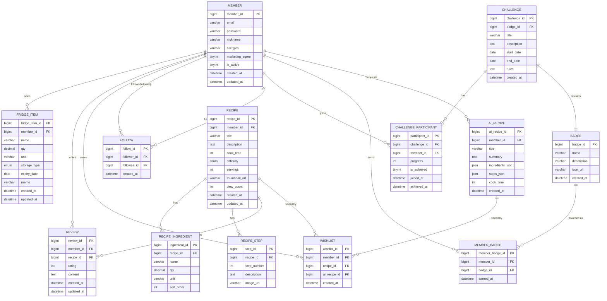

# 🥬 냉장고 파머 — ERD 설계서

> **연관 문서**: 🥬 냉장고 파머 — User Flow 기획서
> **DB**: MySQL 8
> **ORM**: MyBatis (XML Mapper 방식)
> **콜레이션 규칙**: snake_case, PK는 `{table}_id` AUTO_INCREMENT, 생성/수정 시간 `created_at` / `updated_at` DEFAULT CURRENT_TIMESTAMP
> **총 테이블 수**: 13개

---

## 1. 전체 ERD 다이어그램



---

## 2. 테이블 상세 명세

### 👤 MEMBER — 회원

| 컬럼명 | 타입 | 제약조건 | 기본값 | 설명 |
| --- | --- | --- | --- | --- |
| member_id | BIGINT | PK, AUTO_INCREMENT | - | 회원 고유 ID |
| email | VARCHAR(100) | UNIQUE, NOT NULL | - | 로그인 이메일 |
| password | VARCHAR(255) | NOT NULL | - | BCrypt 암호화 저장 |
| nickname | VARCHAR(20) | UNIQUE, NOT NULL | - | 화면 표시명 |
| allergies | VARCHAR(255) | NULL | NULL | 알레르기 식재료 (콤마 구분 문자열) |
| marketing_agree | TINYINT(1) | NOT NULL | 0 | 마케팅 수신 동의 여부 |
| is_active | TINYINT(1) | NOT NULL | 1 | 탈퇴 시 0 설정 (소프트 삭제) |
| created_at | DATETIME | NOT NULL | CURRENT_TIMESTAMP | 가입일시 |
| updated_at | DATETIME | NOT NULL | CURRENT_TIMESTAMP ON UPDATE | 수정일시 |

### 🧊 FRIDGE_ITEM — 냉장고 재료

| 컬럼명 | 타입 | 제약조건 | 기본값 | 설명 |
| --- | --- | --- | --- | --- |
| fridge_item_id | BIGINT | PK, AUTO_INCREMENT | - | - |
| member_id | BIGINT | FK(member), NOT NULL | - | - |
| name | VARCHAR(50) | NOT NULL | - | 재료명 |
| qty | DECIMAL(10,2) | NOT NULL | - | 수량 |
| unit | VARCHAR(10) | NOT NULL | - | 단위 (개/g/ml/L 등) |
| storage_type | ENUM | NOT NULL | 'FRIDGE' | 'FRIDGE' \| 'FREEZER' \| 'ROOM_TEMP' |
| expiry_date | DATE | NOT NULL | - | 유통기한일 |
| memo | VARCHAR(100) | NULL | NULL | 메모 |
| created_at | DATETIME | NOT NULL | CURRENT_TIMESTAMP | - |
| updated_at | DATETIME | NOT NULL | CURRENT_TIMESTAMP ON UPDATE | - |

### 🍳 RECIPE — 레시피

| 컬럼명 | 타입 | 제약조건 | 기본값 | 설명 |
| --- | --- | --- | --- | --- |
| recipe_id | BIGINT | PK, AUTO_INCREMENT | - | - |
| member_id | BIGINT | FK(member), NOT NULL | - | 작성자 ID |
| title | VARCHAR(100) | NOT NULL | - | 레시피명 |
| description | TEXT | NULL | - | 레시피 소개 |
| cook_time | INT | NOT NULL | - | 조리 시간(분) |
| difficulty | ENUM | NOT NULL | 'EASY' | 'EASY' \| 'MEDIUM' \| 'HARD' |
| servings | INT | NOT NULL | 2 | 인원(명) |
| thumbnail_url | VARCHAR(500) | NULL | NULL | 대표 이미지 URL |
| view_count | INT | NOT NULL | 0 | 조회수 |
| created_at | DATETIME | NOT NULL | CURRENT_TIMESTAMP | - |
| updated_at | DATETIME | NOT NULL | CURRENT_TIMESTAMP ON UPDATE | - |

> ℹ️ **영양 컬럼 5개 추가됨** (2026-06-01, 변경 로그 참조): `calories` INT, `carbs` DECIMAL(6,1), `protein` DECIMAL(6,1), `fat` DECIMAL(6,1), `sodium` DECIMAL(7,1).

### 🥪 RECIPE_INGREDIENT — 레시피 재료

| 컬럼명 | 타입 | 제약조건 | 기본값 | 설명 |
| --- | --- | --- | --- | --- |
| ingredient_id | BIGINT | PK, AUTO_INCREMENT | - | - |
| recipe_id | BIGINT | FK(recipe), NOT NULL | - | - |
| name | VARCHAR(50) | NOT NULL | - | 재료명 |
| qty | DECIMAL(10,2) | NOT NULL | - | 수량 |
| unit | VARCHAR(10) | NOT NULL | - | 단위 |
| sort_order | INT | NOT NULL | 0 | 재료 내역 순서 |

### 📝 RECIPE_STEP — 조리 순서

| 컬럼명 | 타입 | 제약조건 | 기본값 | 설명 |
| --- | --- | --- | --- | --- |
| step_id | BIGINT | PK, AUTO_INCREMENT | - | - |
| recipe_id | BIGINT | FK(recipe), NOT NULL | - | - |
| step_number | INT | NOT NULL | - | 단계 번호 |
| description | TEXT | NOT NULL | - | 조리 설명 |
| image_url | VARCHAR(500) | NULL | NULL | 단계별 이미지 |

### ⭐ REVIEW — 리뷰

| 컬럼명 | 타입 | 제약조건 | 기본값 | 설명 |
| --- | --- | --- | --- | --- |
| review_id | BIGINT | PK, AUTO_INCREMENT | - | - |
| member_id | BIGINT | FK(member), NOT NULL | - | 작성자 |
| recipe_id | BIGINT | FK(recipe), NOT NULL | - | - |
| rating | TINYINT | NOT NULL, CHECK(1~5) | - | 1~5점 별점 |
| content | TEXT | NOT NULL | - | 리뷰 내용 |
| created_at | DATETIME | NOT NULL | CURRENT_TIMESTAMP | - |
| updated_at | DATETIME | NOT NULL | CURRENT_TIMESTAMP ON UPDATE | - |

> 📌 **UNIQUE KEY** `uq_review_member_recipe` (member_id, recipe_id) — 회원당 레시피 1개 리뷰만 허용

### ❤️ WISHLIST — 찜

| 컬럼명 | 타입 | 제약조건 | 기본값 | 설명 |
| --- | --- | --- | --- | --- |
| wishlist_id | BIGINT | PK, AUTO_INCREMENT | - | - |
| member_id | BIGINT | FK(member), NOT NULL | - | - |
| recipe_id | BIGINT | FK(recipe), NULL | NULL | AI 찜 시 NULL 가능 |
| ai_recipe_id | BIGINT | FK(ai_recipe), NULL | NULL | AI 찜 시 사용 |
| created_at | DATETIME | NOT NULL | CURRENT_TIMESTAMP | - |

> 📌 **UNIQUE KEY** `uq_wishlist_member_recipe` (member_id, recipe_id) · `uq_wishlist_member_ai` (member_id, ai_recipe_id)
> **FK** ai_recipe_id → ai_recipe(ai_recipe_id) ON DELETE CASCADE ✨ *신규 추가 (2026-05-29)*
> **CHECK** `chk_wishlist_xor` — recipe_id와 ai_recipe_id 중 정확히 하나만 NOT NULL (DDL 레벨 강제)

### 👥 FOLLOW — 팔로우

| 컬럼명 | 타입 | 제약조건 | 기본값 | 설명 |
| --- | --- | --- | --- | --- |
| follow_id | BIGINT | PK, AUTO_INCREMENT | - | - |
| follower_id | BIGINT | FK(member), NOT NULL | - | 팔로우를 개시한 사용자 |
| followee_id | BIGINT | FK(member), NOT NULL | - | 팔로우 당한 사용자 |
| created_at | DATETIME | NOT NULL | CURRENT_TIMESTAMP | - |

> 📌 **UNIQUE KEY** `uq_follow` (follower_id, followee_id) — 중복 팔로우 방지
> **CHECK** follower_id != followee_id — 자기 자신 팔로우 방지

### 🏆 CHALLENGE — 코스

| 컬럼명 | 타입 | 제약조건 | 기본값 | 설명 |
| --- | --- | --- | --- | --- |
| challenge_id | BIGINT | PK, AUTO_INCREMENT | - | - |
| badge_id | BIGINT | FK(badge), NOT NULL | - | 달성 시 지급할 배지 |
| title | VARCHAR(100) | NOT NULL | - | 코스명 |
| description | TEXT | NULL | - | 코스 소개 |
| start_date | DATE | NOT NULL | - | 시작일 |
| end_date | DATE | NOT NULL | - | 마감일 |
| rules | TEXT | NULL | NULL | 코스 조건 (JSON 문자열) |
| created_at | DATETIME | NOT NULL | CURRENT_TIMESTAMP | - |

### 📊 CHALLENGE_PARTICIPANT — 코스 참여

| 컬럼명 | 타입 | 제약조건 | 기본값 | 설명 |
| --- | --- | --- | --- | --- |
| participant_id | BIGINT | PK, AUTO_INCREMENT | - | - |
| challenge_id | BIGINT | FK(challenge), NOT NULL | - | - |
| member_id | BIGINT | FK(member), NOT NULL | - | - |
| progress | INT | NOT NULL | 0 | 진행률 (0~100) |
| is_achieved | TINYINT(1) | NOT NULL | 0 | 달성 여부 |
| joined_at | DATETIME | NOT NULL | CURRENT_TIMESTAMP | 참여일시 |
| achieved_at | DATETIME | NULL | NULL | 달성일시 |

> 📌 **UNIQUE KEY** `uq_participant` (challenge_id, member_id) — 코스당 1회 참여만 허용

### 🏅 BADGE / MEMBER_BADGE — 배지

| 테이블 | 컬럼명 | 타입 | 제약 | 설명 |
| --- | --- | --- | --- | --- |
| BADGE | badge_id | BIGINT | PK | 배지 ID |
| BADGE | name | VARCHAR(50) | UNIQUE, NOT NULL | 배지명 |
| BADGE | description | VARCHAR(255) | NULL | 달성 조건 설명 |
| BADGE | icon_url | VARCHAR(500) | NULL | 배지 이미지 URL |
| MEMBER_BADGE | member_badge_id | BIGINT | PK | - |
| MEMBER_BADGE | member_id | BIGINT | FK(member) | - |
| MEMBER_BADGE | badge_id | BIGINT | FK(badge) | - |
| MEMBER_BADGE | earned_at | DATETIME | NOT NULL | 획득일시 |

### 🤖 AI_RECIPE — AI 생성 레시피

| 컬럼명 | 타입 | 제약조건 | 기본값 | 설명 |
| --- | --- | --- | --- | --- |
| ai_recipe_id | BIGINT | PK, AUTO_INCREMENT | - | - |
| member_id | BIGINT | FK(member), NOT NULL | - | 요청한 회원 |
| title | VARCHAR(100) | NOT NULL | - | AI 생성 레시피명 |
| summary | TEXT | NULL | - | AI 생성 소개 문구 |
| ingredients_json | JSON | NOT NULL | - | 재료 목록 (JSON 배열) |
| steps_json | JSON | NOT NULL | - | 조리 순서 (JSON 배열) |
| cook_time | INT | NULL | NULL | 예상 조리 시간(분) |
| created_at | DATETIME | NOT NULL | CURRENT_TIMESTAMP | - |

---

## 3. 인덱스 전략

| 테이블 | 인덱스명 | 컬럼 | 목적 |
| --- | --- | --- | --- |
| fridge_item | idx_fridge_member | member_id | 냉장고 목록 조회 |
| fridge_item | idx_fridge_expiry | member_id, expiry_date | 임박순 정렬 조회 |
| recipe | idx_recipe_title | title | 키워드 검색 (FULLTEXT) |
| recipe | idx_recipe_cook_time | cook_time | 조리 시간 필터 |
| recipe_ingredient | idx_ingredient_name | name | 재료명 검색 |
| recipe_ingredient | idx_ingredient_recipe | recipe_id | 레시피별 재료 조회 |
| review | idx_review_recipe | recipe_id | 레시피별 리뷰 조회 |
| review | idx_review_member | member_id | 회원별 리뷰 조회 |
| wishlist | idx_wishlist_member | member_id | 찜 목록 조회 |
| follow | idx_follow_follower | follower_id | 내가 팔로우한 목록 |
| follow | idx_follow_followee | followee_id | 나를 팔로우한 목록 |
| challenge | idx_challenge_date | start_date, end_date | 진행 중 코스 필터 |

---

## 4. 테이블 관계 요약

| 부모 테이블 | 자식 테이블 | 관계 | 삭제 정책 |
| --- | --- | --- | --- |
| MEMBER | FRIDGE_ITEM | 1:N | CASCADE DELETE |
| MEMBER | REVIEW | 1:N | CASCADE DELETE |
| MEMBER | WISHLIST | 1:N | CASCADE DELETE |
| MEMBER | FOLLOW (follower) | 1:N | CASCADE DELETE |
| MEMBER | FOLLOW (followee) | 1:N | CASCADE DELETE |
| MEMBER | CHALLENGE_PARTICIPANT | 1:N | CASCADE DELETE |
| MEMBER | MEMBER_BADGE | 1:N | CASCADE DELETE |
| MEMBER | AI_RECIPE | 1:N | CASCADE DELETE |
| RECIPE | RECIPE_INGREDIENT | 1:N | CASCADE DELETE |
| RECIPE | RECIPE_STEP | 1:N | CASCADE DELETE |
| RECIPE | REVIEW | 1:N | CASCADE DELETE |
| RECIPE | WISHLIST | 1:N | CASCADE DELETE *(2026-05-29 SET NULL에서 변경)* |
| AI_RECIPE | WISHLIST | 1:N | CASCADE DELETE *(2026-05-29 신규)* |
| BADGE | CHALLENGE | 1:1 | RESTRICT |
| BADGE | MEMBER_BADGE | 1:N | CASCADE DELETE |
| CHALLENGE | CHALLENGE_PARTICIPANT | 1:N | CASCADE DELETE |

---

## 5. DDL 스크립트 (핵심 테이블)

```sql
-- 1. MEMBER
CREATE TABLE member (
    member_id   BIGINT       NOT NULL AUTO_INCREMENT,
    email       VARCHAR(100) NOT NULL,
    password    VARCHAR(255) NOT NULL,
    nickname    VARCHAR(20)  NOT NULL,
    allergies   VARCHAR(255),
    marketing_agree TINYINT(1) NOT NULL DEFAULT 0,
    is_active   TINYINT(1)   NOT NULL DEFAULT 1,
    created_at  DATETIME     NOT NULL DEFAULT CURRENT_TIMESTAMP,
    updated_at  DATETIME     NOT NULL DEFAULT CURRENT_TIMESTAMP ON UPDATE CURRENT_TIMESTAMP,
    PRIMARY KEY (member_id),
    UNIQUE KEY uq_member_email (email),
    UNIQUE KEY uq_member_nickname (nickname)
) ENGINE=InnoDB DEFAULT CHARSET=utf8mb4;

-- 2. FRIDGE_ITEM
CREATE TABLE fridge_item (
    fridge_item_id BIGINT          NOT NULL AUTO_INCREMENT,
    member_id      BIGINT          NOT NULL,
    name           VARCHAR(50)     NOT NULL,
    qty            DECIMAL(10,2)   NOT NULL,
    unit           VARCHAR(10)     NOT NULL,
    storage_type   ENUM('FRIDGE','FREEZER','ROOM_TEMP') NOT NULL DEFAULT 'FRIDGE',
    expiry_date    DATE            NOT NULL,
    memo           VARCHAR(100),
    created_at     DATETIME        NOT NULL DEFAULT CURRENT_TIMESTAMP,
    updated_at     DATETIME        NOT NULL DEFAULT CURRENT_TIMESTAMP ON UPDATE CURRENT_TIMESTAMP,
    PRIMARY KEY (fridge_item_id),
    KEY idx_fridge_member (member_id),
    KEY idx_fridge_expiry (member_id, expiry_date),
    CONSTRAINT fk_fridge_member FOREIGN KEY (member_id) REFERENCES member(member_id) ON DELETE CASCADE
) ENGINE=InnoDB DEFAULT CHARSET=utf8mb4;

-- 3. RECIPE
CREATE TABLE recipe (
    recipe_id     BIGINT       NOT NULL AUTO_INCREMENT,
    member_id     BIGINT       NOT NULL,
    title         VARCHAR(100) NOT NULL,
    description   TEXT,
    cook_time     INT          NOT NULL,
    difficulty    ENUM('EASY','MEDIUM','HARD') NOT NULL DEFAULT 'EASY',
    servings      INT          NOT NULL DEFAULT 2,
    thumbnail_url VARCHAR(500),
    view_count    INT          NOT NULL DEFAULT 0,
    created_at    DATETIME     NOT NULL DEFAULT CURRENT_TIMESTAMP,
    updated_at    DATETIME     NOT NULL DEFAULT CURRENT_TIMESTAMP ON UPDATE CURRENT_TIMESTAMP,
    PRIMARY KEY (recipe_id),
    KEY idx_recipe_cook_time (cook_time),
    FULLTEXT KEY ft_recipe_title (title),
    CONSTRAINT fk_recipe_member FOREIGN KEY (member_id) REFERENCES member(member_id)
) ENGINE=InnoDB DEFAULT CHARSET=utf8mb4;

-- 4. REVIEW
CREATE TABLE review (
    review_id  BIGINT   NOT NULL AUTO_INCREMENT,
    member_id  BIGINT   NOT NULL,
    recipe_id  BIGINT   NOT NULL,
    rating     TINYINT  NOT NULL CHECK (rating BETWEEN 1 AND 5),
    content    TEXT     NOT NULL,
    created_at DATETIME NOT NULL DEFAULT CURRENT_TIMESTAMP,
    updated_at DATETIME NOT NULL DEFAULT CURRENT_TIMESTAMP ON UPDATE CURRENT_TIMESTAMP,
    PRIMARY KEY (review_id),
    UNIQUE KEY uq_review_member_recipe (member_id, recipe_id),
    KEY idx_review_recipe (recipe_id),
    CONSTRAINT fk_review_member FOREIGN KEY (member_id) REFERENCES member(member_id) ON DELETE CASCADE,
    CONSTRAINT fk_review_recipe FOREIGN KEY (recipe_id) REFERENCES recipe(recipe_id) ON DELETE CASCADE
) ENGINE=InnoDB DEFAULT CHARSET=utf8mb4;

-- 5. WISHLIST (2026-05-29 수정: fk_wishlist_recipe 정책 변경 + fk_wishlist_ai_recipe 신규 + XOR CHECK)
CREATE TABLE wishlist (
    wishlist_id   BIGINT   NOT NULL AUTO_INCREMENT,
    member_id     BIGINT   NOT NULL,
    recipe_id     BIGINT,
    ai_recipe_id  BIGINT,
    created_at    DATETIME NOT NULL DEFAULT CURRENT_TIMESTAMP,
    PRIMARY KEY (wishlist_id),
    UNIQUE KEY uq_wishlist_member_recipe (member_id, recipe_id),
    UNIQUE KEY uq_wishlist_member_ai     (member_id, ai_recipe_id),
    KEY idx_wishlist_member (member_id),
    KEY idx_wishlist_ai_recipe (ai_recipe_id),
    CONSTRAINT fk_wishlist_member FOREIGN KEY (member_id) REFERENCES member(member_id) ON DELETE CASCADE,
    CONSTRAINT fk_wishlist_recipe FOREIGN KEY (recipe_id) REFERENCES recipe(recipe_id) ON DELETE CASCADE,
    CONSTRAINT fk_wishlist_ai_recipe FOREIGN KEY (ai_recipe_id) REFERENCES ai_recipe(ai_recipe_id) ON DELETE CASCADE,
    CONSTRAINT chk_wishlist_xor CHECK (
        (recipe_id IS NOT NULL AND ai_recipe_id IS NULL) OR
        (recipe_id IS NULL     AND ai_recipe_id IS NOT NULL)
    )
) ENGINE=InnoDB DEFAULT CHARSET=utf8mb4;

-- 6. FOLLOW
CREATE TABLE follow (
    follow_id   BIGINT   NOT NULL AUTO_INCREMENT,
    follower_id BIGINT   NOT NULL,
    followee_id BIGINT   NOT NULL,
    created_at  DATETIME NOT NULL DEFAULT CURRENT_TIMESTAMP,
    PRIMARY KEY (follow_id),
    UNIQUE KEY uq_follow (follower_id, followee_id),
    KEY idx_follow_followee (followee_id),
    CONSTRAINT fk_follow_follower FOREIGN KEY (follower_id) REFERENCES member(member_id) ON DELETE CASCADE,
    CONSTRAINT fk_follow_followee FOREIGN KEY (followee_id) REFERENCES member(member_id) ON DELETE CASCADE,
    CONSTRAINT chk_follow_self CHECK (follower_id != followee_id)
) ENGINE=InnoDB DEFAULT CHARSET=utf8mb4;
```

---

> ✅ **ERD 완료** — 총 13개 테이블, 주요 연관 관계와 제약 조건, 인덱스 전략, DDL 스크립트 포함 ✨ *2026-05-29 보강 완료 (하단 변경사항 참조)*
> **다음 단계 권장**: API 명세서 작성 → Spring Boot Controller · Service · Mapper 개발

---

# 🆕 2026-05-29 1주차 진행 중 변경사항

> WBS-① DDL 작성 작업 중 발견 및 결정된 ERD/DDL 변경 사항입니다.
> 원본 ERD 설계서 본문의 해당 부분을 이 내용으로 갱신해주세요.

## 🔴 Critical — DDL 실행 거부 버그 수정

### 1. WISHLIST 테이블 — `fk_wishlist_recipe` 삭제 정책 변경

| 항목 | Before | After |
| --- | --- | --- |
| ON DELETE 정책 | `SET NULL` | **`CASCADE`** |

**변경 이유**: MySQL 8은 CHECK 제약에 사용된 컬럼을 SET NULL action으로 변경 불가 (Error 3823 발생). 원본 정책 그대로면 DDL 자체가 실행 거부됨.

**영향**: 일반 레시피 삭제 시, 해당 레시피에 대한 찜이 함께 삭제됨. 사용자 UX 측면에서 "죽은 링크"보다 자연스러운 처리.

### 2. WISHLIST 테이블 — `fk_wishlist_ai_recipe` 신규 추가

| 항목 | Before | After |
| --- | --- | --- |
| ai_recipe_id FK | **없음 (누락)** | `FOREIGN KEY (ai_recipe_id) REFERENCES ai_recipe(ai_recipe_id) ON DELETE CASCADE` |

**변경 이유**: 원본 ERD에 FK가 누락되어 존재하지 않는 AI 레시피 ID를 찜할 수 있는 무결성 구멍 존재.

### 3. WISHLIST 테이블 — XOR CHECK 제약 신규 추가

```sql
CONSTRAINT chk_wishlist_xor CHECK (
    (recipe_id IS NOT NULL AND ai_recipe_id IS NULL) OR
    (recipe_id IS NULL     AND ai_recipe_id IS NOT NULL)
)
```

**변경 이유**: ERD 본문 설명에는 "XOR이어야 함"이라 명시되어 있었으나 DDL에 누락. 일반 레시피와 AI 레시피가 동시에 채워지거나 둘 다 NULL인 경우 차단.

## 🟠 Important — AI_RECIPE 테이블 컬럼 보강

### 4. AI_RECIPE — 누락된 컬럼 4개 추가

| 컬럼명 | 타입 | 제약 | 설명 |
| --- | --- | --- | --- |
| `ingredients_json` | JSON | NOT NULL | 재료 JSON 배열 |
| `steps_json` | JSON | NOT NULL | 조리 순서 JSON 배열 |
| `cook_time` | INT | DEFAULT NULL | 예상 조리 시간 (분) |
| `created_at` | DATETIME | NOT NULL DEFAULT CURRENT_TIMESTAMP | 생성일시 |

### 5. AI_RECIPE — JSON 타입 검증 CHECK 제약 추가

```sql
CONSTRAINT chk_ai_ingredients_array CHECK (JSON_TYPE(ingredients_json) = 'ARRAY')
CONSTRAINT chk_ai_steps_array       CHECK (JSON_TYPE(steps_json)       = 'ARRAY')
```

**변경 이유**: LLM이 객체로 응답하는 사고 차단 (배열 강제).

## 🟢 추가된 CHECK 제약 (데이터 무결성 강화)

| 테이블 | 추가된 제약 | 의도 |
| --- | --- | --- |
| `fridge_item` | `chk_fridge_qty_positive` (qty >= 0) | 음수 수량 차단 |
| `recipe` | `chk_recipe_cook_time` (cook_time IS NULL OR cook_time > 0) | 음수/0 조리시간 차단 |
| `recipe_step` | `chk_step_number_positive` (step_number > 0) | 음수 단계 번호 차단 |
| `recipe_step` | UNIQUE (recipe_id, step_number) | 같은 단계 중복 차단 |
| `review` | `chk_review_rating` (rating BETWEEN 1 AND 5) | 평점 범위 강제 |
| `review` | UNIQUE (member_id, recipe_id) | 중복 리뷰 차단 (API 409 트리거) |
| `follow` | `chk_follow_self` (follower_id <> followee_id) | 자기 팔로우 차단 |
| `challenge` | `chk_challenge_dates` (start_date <= end_date) | 잘못된 기간 차단 |
| `challenge_participant` | `chk_progress_range` (progress BETWEEN 0 AND 100) | 비정상 진행률 차단 |
| `member_badge` | UNIQUE (member_id, badge_id) | 중복 배지 지급 차단 |

## 🔵 인덱스 — 본문 표에만 있던 12종 명시적 추가

원본 ERD "인덱스 전략" 표에 정의되었으나 DDL에 미반영되었던 인덱스들을 `V2__indexes.sql`로 분리.

| 인덱스명 | 테이블 | 컬럼 | 용도 |
| --- | --- | --- | --- |
| `idx_fridge_expiry` | fridge_item | (member_id, expiry_date) | 임박 재료 조회 |
| `idx_recipe_title` | recipe | title (FULLTEXT + ngram) | 한글 부분일치 검색 |
| `idx_recipe_cook_time` | recipe | cook_time | 조리시간 필터 |
| `idx_recipe_view_count` | recipe | view_count DESC | 인기순 정렬 |
| `idx_ingredient_name` | recipe_ingredient | name | 보유 재료 매칭 (F17) |
| `idx_review_recipe_created` | review | (recipe_id, created_at DESC) | 리뷰 최신순 |
| `idx_wishlist_member_created` | wishlist | (member_id, created_at DESC) | 찜 최신순 |
| `idx_wishlist_ai_recipe` | wishlist | ai_recipe_id | **신규 FK 인덱스** |
| `idx_follow_followee` | follow | followee_id | 팔로워 목록 |
| `idx_challenge_date` | challenge | (start_date, end_date) | 진행중 챌린지 |
| `idx_ai_recipe_member_created` | ai_recipe | (member_id, created_at DESC) | AI 추천 히스토리 |

## 📋 테이블 생성 순서 변경

- **Before**: AI_RECIPE가 13번 (맨 뒤)
- **After**: AI_RECIPE를 **7번 (WISHLIST 앞)**으로 이동

**이유**: WISHLIST가 AI_RECIPE를 FK로 참조하므로 의존성 순서 준수.

## ✅ 변경사항 검증 완료

- DDL 정상 실행 (13개 테이블 생성 확인)
- `chk_wishlist_xor` 동작 검증: 둘 다 NULL 시도 시 Error 3819 발생 확인
- `uq_badge_name` 동작 검증: 중복 INSERT 시 Error 1062 발생 확인
- 시드 데이터 정상 적재 (badge 5, challenge 3, recipe 10, member 2, fridge_item 10)

---

# 📌 추가 반영 메모 (2026-06-01, WBS-④ 확장)

> 위 본문은 1주차 초기 ERD 기준입니다. 이후 식재료 사전이 추가되어 **현재 물리 테이블 수는 14개**(도메인 13 + `ingredient_dictionary`)입니다.

## 🥬 ingredient_dictionary — 식재료 사전 (V5)

| 컬럼명 | 타입 | 설명 |
| --- | --- | --- |
| ingredient_dict_id | BIGINT PK | - |
| name | VARCHAR, UNIQUE | 식재료명 (자동완성/매칭) |
| category | VARCHAR | 채소/과일/육류/수산물/유제품/계란두부/곡류면/양념/가공 |
| default_storage_type | ENUM(FRIDGE/FREEZER/ROOM_TEMP) | 권장 보관 |
| fridge_days | INT | 냉장 보관 가능 일수 |
| freezer_days | INT | 냉동 보관 가능 일수 |
| room_temp_days | INT | 실온 보관 가능 일수 |
| storage_tip | VARCHAR | 보관 팁 |

- 데이터: 150종 큐레이션 (식약처 소비기한 참고값 + 일반 보관 가이드)
- recipe 테이블에 영양 컬럼 5종(`calories`/`carbs`/`protein`/`fat`/`sodium`) 추가됨 (위 RECIPE 표 메모 참조)
